**数字图像处理**

**第四次作业**

姓名：何佳

班级：自动化64

学号：2160700002

提交日期：2019.3.18

**摘要：**
本次作业以数字图像的空域滤波器为主题，先后完成了以下5个任务：①空域低通滤波器：分别用高斯滤波器和中值滤波器去平滑测试图像test1和2，模板大小分别是3x3， 5x5 ，7x7； 分析各自优缺点；②利用固定方差 sigma=1.5产生高斯滤波器，分析各自优缺点；③利用高通滤波器滤波测试图像test3,4：包括unsharp masking, Sobel edge detector, and Laplacian edge detection；Canny algorithm.分析各自优缺点。通过本次作业对空域滤波器有了较为全面的掌握，以上的任务均得到良好的结果。

#### 一、空域低通滤波器：分别用高斯滤波器和中值滤波器去平滑测试图像test1和test2，模板大小分别是3x3，5x5，7x7；

1.1 问题分析

空域滤波分为：平滑滤波（低通滤波）、锐化滤波（高通滤波）；平滑滤波（低通滤波）：过滤掉图像中的高频部分（灰度变化较大较快部分）使得图像直方图分布均匀；锐化滤波（高通滤波）：过滤掉图像中的低频部分，让图像灰度变化大的地方更加的突出，如图像边界、交界地方；线性平滑滤波：均值滤波、高斯滤波；非线性平滑滤波：中值滤波；中值滤波：对噪声敏感度低，能够较好的消除椒盐噪声，易导致图像不连续；高斯滤波：能较好的消除服从正态分布的噪声。

1）中值滤波

最常用的非线性滤波是中值滤波。中值滤波的基本步骤是：（1）将模板在图中漫游，并将模板中心与图中某个像素位置重合；（2）读取模板下各对应像素的灰度值；（3）将这些灰度值从小到大排成一列；（4）找出这些灰度值里排在中间的一个；（5）将这个中间值赋给对应模板中心位置的像素。

Matlab函数：medfilt2(BW,[m n]);  [m n ]指定模板尺寸

2）高斯滤波

对于图像的高斯滤波器需要运用二维的高斯函数，对于零均值的二维高斯函数为:

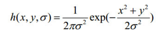

其中x、y是像素的坐标位置，r 是模糊半径，σ是正态分布的标准偏差。这个公式生成

的曲面的等高线是从中心开始呈正态分布的同心圆。分布不为零的像素组成的卷积矩阵与原始图像做变换。每个像素的值都是周围相邻像素值的加权平均。原始像素的值有最大的高斯分布值，所以有最大的权重，相邻像素随着距离原始像素越来越远，其权重也越来越小。这样进行模糊处理比其它的均衡模糊滤波器更高地保留了边缘效果。

Matlab函数：

gaus=fspecial('gaussian', [3,3], 1); %[3,3]代表了模板大小，1为方差

gausout=imfilter(Img,gaus1,'replicate');%图像大小通过赋值外边界的值来扩展

1.2处理结果

1）test1

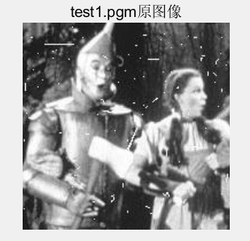

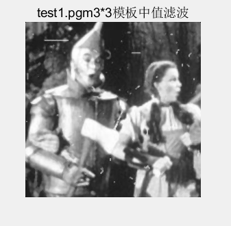

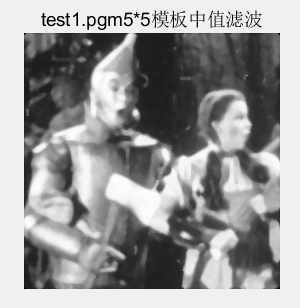

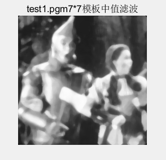

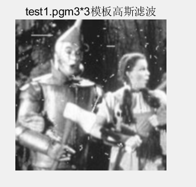

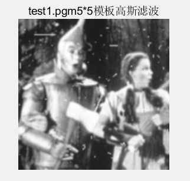

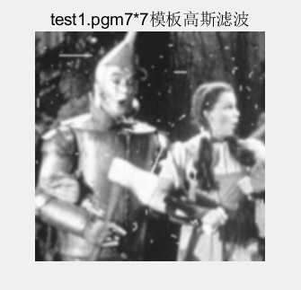

2）test2

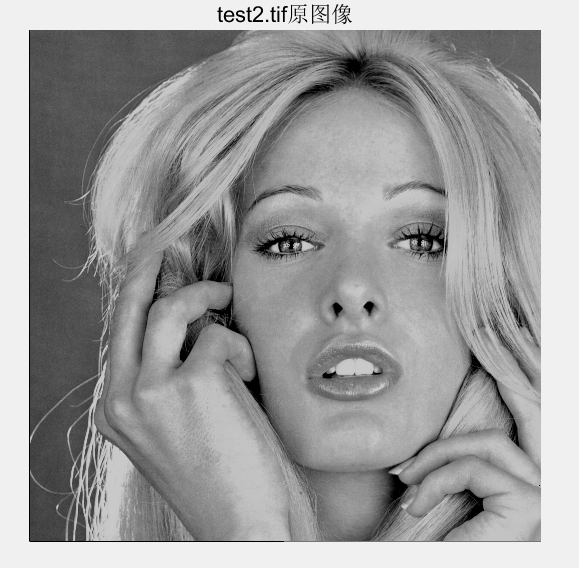

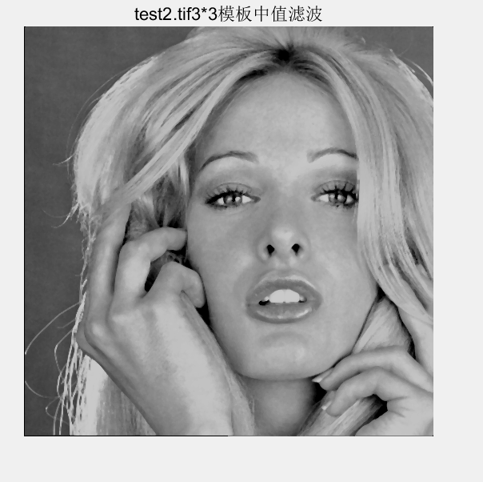

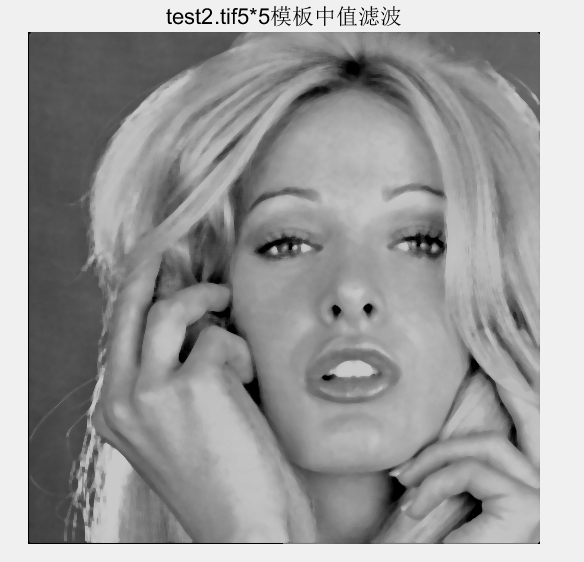

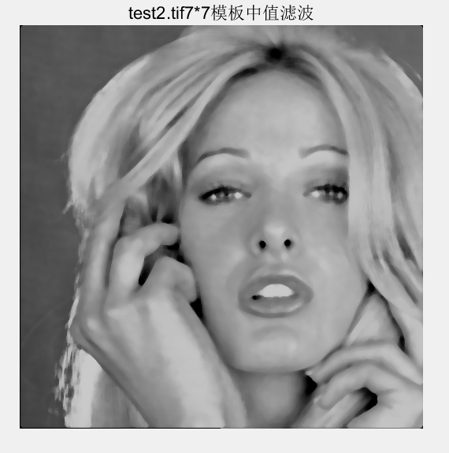

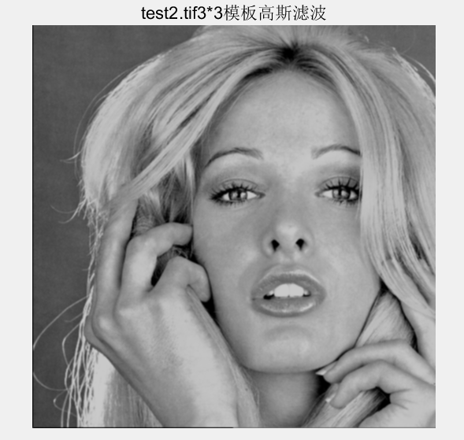

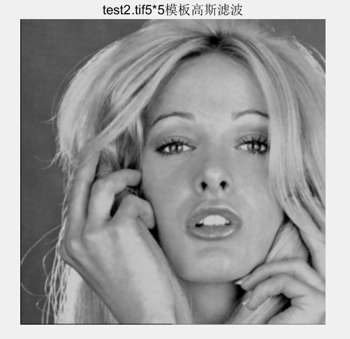

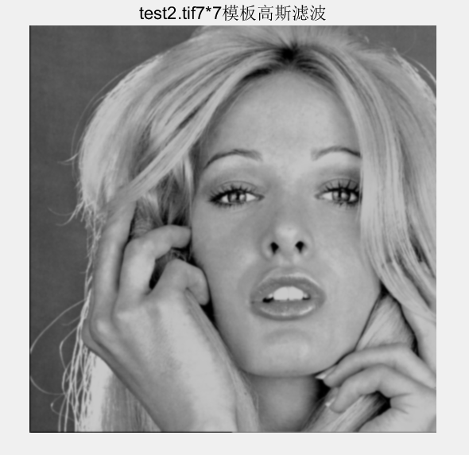

1.3结果分析与讨论

中值滤波器的主要功能是使拥有不同灰度的点更接近于它的相邻点。事实上，使用mXm中值滤波器来去除那些相对于其邻域像素更亮或更暗并且其区域小于m\^2/2(滤波器区域的一半)的孤立像素族。在这种情况下，“去除“的意思是强制为邻域的中值灰度。较大的族所受到的影响明显较小。从处理后的图像看，图像的平滑效果较为明显，且受窗口的影响，窗口越大，平滑效果越明显，图像细节越模糊，尤其是test2中人脸图像的眼睛部分，随着滤波器模板的增大，可以明显的感受到图像模糊的效果。另外，对比编写的程序的处理结果和medfilt2函数的处理结果，可以看出处理效果基本一致。

#### 二、利用固定方差 sigma=1.5产生高斯滤波器，分析各自优缺点

2.1 问题分析

均值为 0，方差为 σ2的二维高斯函数如下：

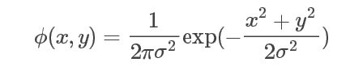

当标准差 σ取不同的值时，二维高斯函数的形状会有较大的变化。

（1）如果σ过小，偏离中心的所有像素权值将会非常之小，相当于加权和响应基本不考虑邻域像素的作用。这样滤波运算退化为点运算，无法起到平滑噪声的作用

（2）如果 σ过大，而邻域相对较小，这样在邻域内高斯模板退化为平均模板。

2.2处理结果

对“test2.tif”图像分别进行自编高斯滤波和matlab自带高斯滤波：

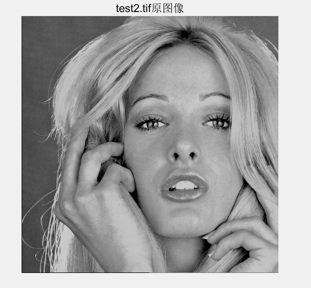

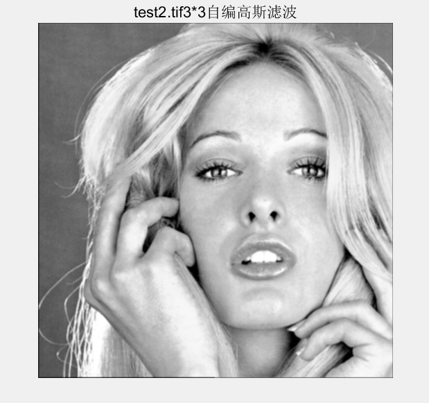

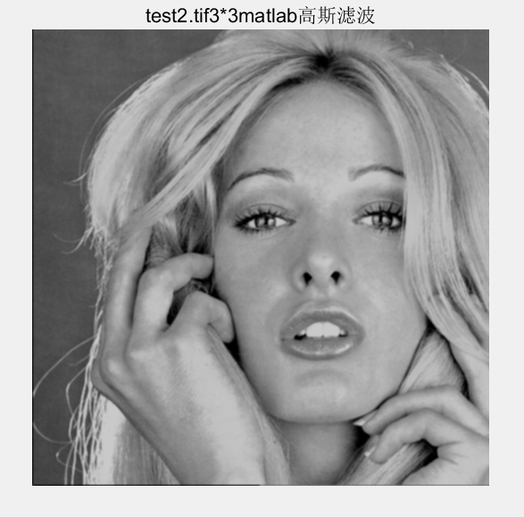

2.3 结果分析与讨论

高斯滤波是一种线性平滑滤波，适用于消除高斯噪声，广泛应用于图像处理的减噪过程。通俗的讲，高斯滤波就是对整幅图像进行加权平均的过程，每一个像素
点的值，都由其本身和邻域内的其他像素值经过加权平均后得到。高斯滤波的具体操作是:用一个模板(或称卷积、掩模)扫描图像中的每一个像素，用模板确定的邻域内像素的加权平均灰度值去替代模板中心像素点的值。从处理后的图像看，图像的平滑效果较为明显，且受窗口的影响，窗口越大，平滑效果越明显，图像细节越模糊。将编写的程序处理结果和调用MATLAB中函数处理结果对比，发现处理结果基本相同。

#### 三、利用高通滤波器滤波测试图像test3,4:包括unsharp masking, Sobel edge detector, and Laplacian edge detection, Canny algorithm

3.1问题分析

锐化滤波能减弱或消除图像中的低频率分量,但不影响高频率分量。因为低频分量对应图像中灰度值缓慢变化的区域，因而与图像的整体特性，如整体对比度和平均灰度值等有关。锐化滤波将这些分量滤去可使图像反差增加，边缘明显。在实际应用中，锐化滤波可用于增强被模糊的细节或者低对比度图像的目标边缘。线性/非线性锐化滤波：线性滤波常用算子：loplacian算子；非线性锐化滤波常用算子：sobel算子、prewitt算子、log算子等。

1）unsharp masking

线性反锐化掩模（UnSharpMasking，UM）算法最早是应用于摄影技术中，以增强图像的边缘和细节。光学上的操作方法是将聚焦的正片和散焦的负片在底片上进行叠加，结果是增强了正片高频成份，从而增强了轮廓，散焦的负片相当于“模糊”模板（掩模），它与锐化的作用正好相反，因此，该方法被称为反锐化掩模法。

线性反锐化掩模的处理步骤为：首先将原图像低通滤波后产生一个钝化模糊图像，将原图像与这模糊图像相减得到保留高频成份的图像，再将高频图像用一个参数放大后与原图像叠加，这就产生一个增强了边缘的图像。

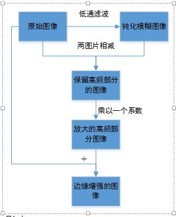

2）Sobel edge detector

索贝尔边缘检测(Sobel edgedetector)主要用作边缘检测，在技术上，它是一离散性差分算子，用来运算图像亮度函数的灰度之近似值。在图像的任何一点使用此算子，将会产生对应的灰度矢量或其法矢量。

该算子包含两组3x3的矩阵，分别为横向及纵向，将之与图像作平面卷积，即可分别得出横向及纵向的亮度差分近似值。如果以A代表原始图像，Gx及Gy分别代表经横向及纵向边缘检测的图像灰度值，其公式如下：

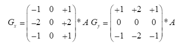

图像的每一个像素的横向及纵向梯度近似值可用以下的公式结合，来计算梯度的大小。

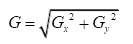

然后可用以下公式计算梯度方向：

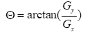

如果角度等于零，即代表图像在该处拥有纵向边缘，左方较右方暗。

3）Laplacian edge detection

Laplacian边缘检测(Laplacian edge detector)是一种二阶边缘检测算子，它是一个线性的、移不变算子。是对二维函数进行运算的二阶导数算子，对一个连续函数f(x, y)它在图像中的位置(x, y),拉普拉斯值定义为：

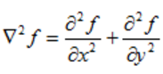

Laplacian算子利用二阶导数信息，具有各向同性，即与坐标轴方向无关，坐标轴旋转后梯度结果不变。使得图像经过二阶微分后，在边缘处产生一个陡峭的零交叉点，根据这个对零交叉点判断边缘。其4邻域系统和8邻域系统的Laplacian算子的模板分别如图所示。

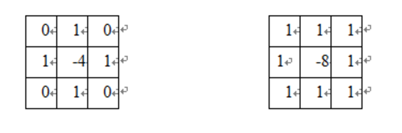

通常使用的拉普拉斯算子3×3模板如图所示：

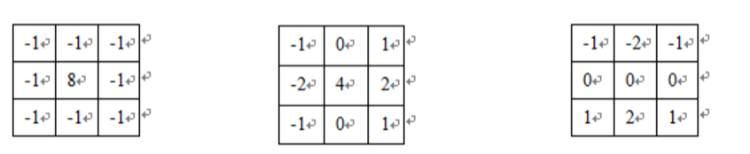

4）Canny algorithm

Canny边缘检测算子是一种多级检测算法。 用 Canny边缘检测算子进行处理的步骤如下：

首先，图像降噪。我们知道梯度算子可以用于增强图像，本质上是通过增强边缘轮廓来实现的，也就是说是可以检测到边缘的。但是，它们受噪声的影响都很大。那么，我们第一步就是想到要先去除噪声，因为噪声就是灰度变化很大的地方，所以容易被识别为伪边缘。

第二步，计算图像梯度，得到可能边缘。我们在前面的关于《图像梯度》文章中有所介绍，计算图像梯度能够得到图像的边缘，因为梯度是灰度变化明显的地方，而边缘也是灰度变化明显的地方。当然这一步只能得到可能的边缘。因为灰度变化的地方可能是边缘，也可能不是边缘。这一步就有了所有可能是边缘的集合。

第三步，非极大值抑制。通常灰度变化的地方都比较集中，将局部范围内的梯度方向上，灰度变化最大的保留下来，其它的不保留，这样可以剔除掉一大部分的点。将有多个像素宽的边缘变成一个单像素宽的边缘。即“胖边缘”变成“瘦边缘”。

第四步，双阈值筛选。通过非极大值抑制后，仍然有很多的可能边缘点，进一步的设置一个双阈值，即低阈值（low），高阈值（high）。灰度变化大于high的，设置为强边缘像素，低于low的，剔除。在low和high之间的设置为弱边缘。进一步判断，如果其领域内有强边缘像素，保留，如果没有，剔除。

3.2处理结果

1）test3

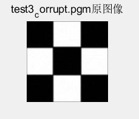

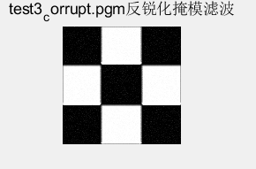

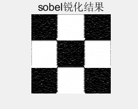

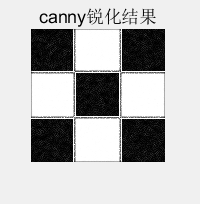

2）test4

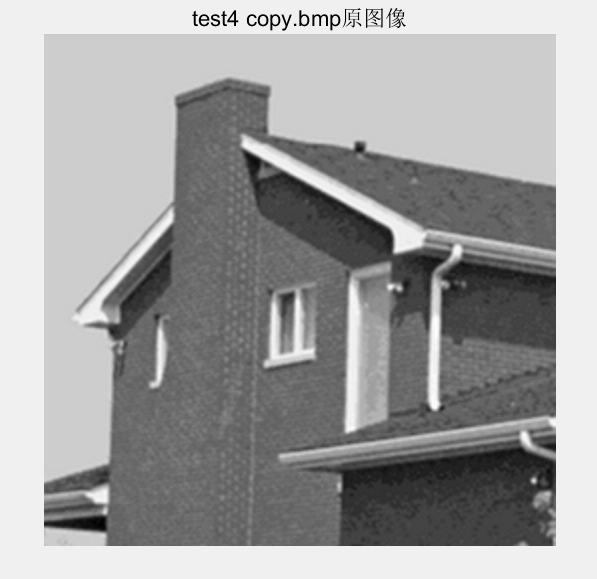

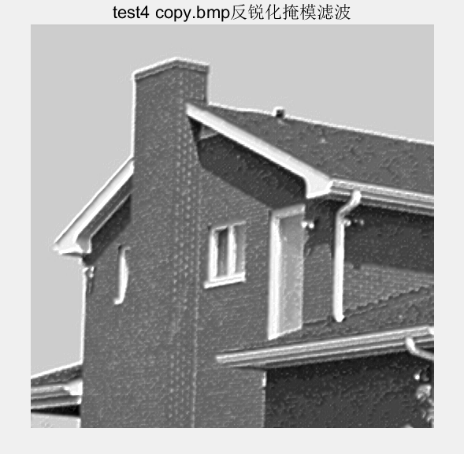

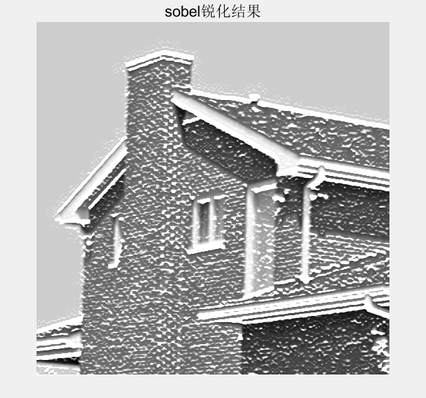

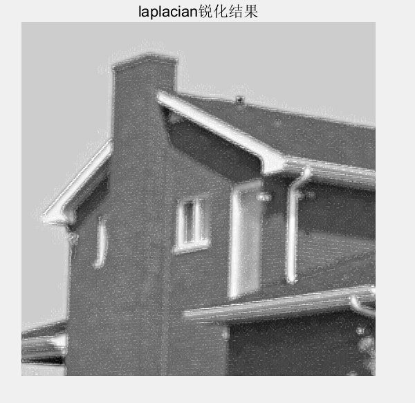

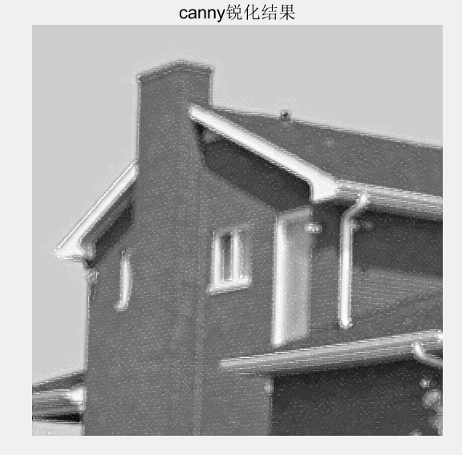

3.3 结果分析与讨论

①反锐化掩膜处理结果得到了边缘更加清晰的图像，与预期改进效果一致。但同时看到也会引进一些不希望看到的噪声。

②索贝尔算子(Sobel operator)
使用Sobel算子得到的边缘线条更粗，但能一定程度上反映边缘在原始图像中的强度，且细节丰富。美中不足的是，Sobel算子并没有将图像的主体与背景严格地区分开来，换言之就是Sobel算子没有基于图像灰度进行处理，由于Sobel算子没有严格地模拟人的视觉生理特征，所以提取的图像轮廓有时并不能令人满意,从图像观察，可以看出索贝尔算子并没有将图像边缘完全分离出来。

③Laplace算子的边缘检测效果并不如一阶算子的效果，观察一阶导数和二阶导数的图像，二阶导数增强域不是频率最高的部分（边缘），而有一定偏差，并且增强幅度并不如一阶导数。如果求绝对值，图像负y轴部分翻正，会产生双边缘。总的来说：Laplace算子做锐化滤波的特点：对噪声敏感，产生双边缘，缓慢区域产生暗背景。

④canny算子体现了以下特性：低错误率的边缘检测：检测算法应该精确地找到图像中的尽可能多的边缘，尽可能的减少漏检和误检。最优定位：检测的边缘点应该精确地定位于边缘的中心。图像中的任意边缘应该只被标记一次，同时图像噪声不应产生伪边缘。

参考文献

https://blog.csdn.net/abigbiggirl/article/details/49836027

https://blog.csdn.net/lanchunhui/article/details/51172705

https://blog.csdn.net/qq_33475105/article/details/80062876

http://blog.sina.com.cn/s/blog_5a69abfb0101fsgh.html

https://blog.csdn.net/saltriver/article/details/80545571
